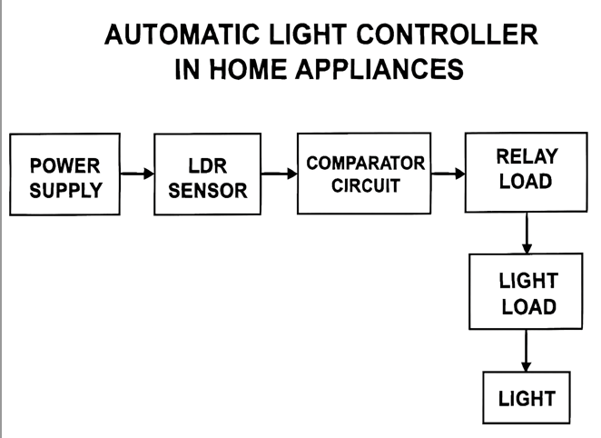
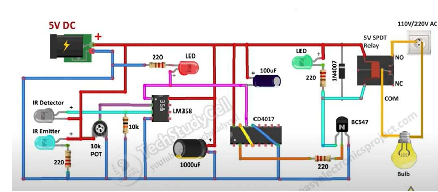
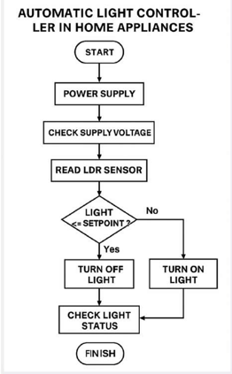
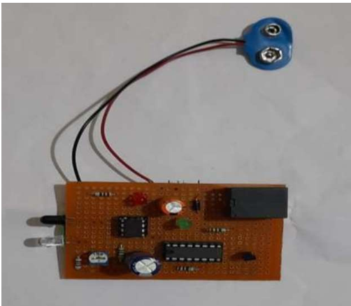
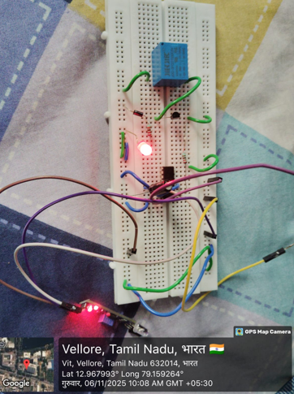

# Automatic Light Controller in Home Appliances

An automatic light controller system using CD4017 IC, LM358 comparator, IR sensor, BC547 transistor, and relay module for intelligent lighting control in home appliances.

##  Project Overview

This project demonstrates a low-cost automatic lighting system that turns ON/OFF lights automatically based on motion or environmental conditions using analog and digital electronic components without any microcontroller.

The system is designed for:
- Energy saving
- Home automation
- Smart lighting
- Educational electronics projects

---

##  Objectives

- Automate light switching
- Reduce power consumption
- Eliminate manual operation
- Demonstrate sensor interfacing
- Learn comparator and relay control circuits

---

##  Components Used

| Component | Quantity |
|---|---|
| CD4017 IC | 1 |
| LM358 IC | 1 |
| BC547 Transistor | 1 |
| IR LED Pair | 1 |
| 5V Relay | 1 |
| 1N4007 Diode | 1 |
| 220Ω Resistors | 4 |
| 10k Resistor | 1 |
| 10k POT | 1 |
| 100uF Capacitor | 1 |
| 1000uF Capacitor | 1 |
| LEDs | 2 |
| Breadboard / PCB | 1 |

---

##  Working Principle

1. IR sensor detects object/motion
2. LM358 comparator processes sensor signal
3. CD4017 receives trigger pulse
4. BC547 transistor drives relay
5. Relay switches AC bulb ON/OFF

---

##  Block Diagram



---

##  Circuit Diagram



---

##  Flowchart



---

## 🛠️ Hardware Prototype

### PCB Prototype



### Breadboard Implementation



---

##  Repository Structure

```text
Automatic-Light-Controller/
│
├── doc/
│   ├── AUTOMATIC LIGHT CONTROLLER (home appliances).pptx
│   ├── PAPER- AUTOMATIC LIGHT CONTROLLER.docx
│   ├── report.docx
│   ├── block.png
│   ├── flowchart.png
│   └── README.md
│
├── hardware/
│   ├── circuit.png
│   ├── hardware.png
│   ├── result.png
│   └── README.md
│
├── result/
│   ├── Video Project.mp4
│   ├── result.png
│   └── README.md
│
├── LICENSE
└── README.md
